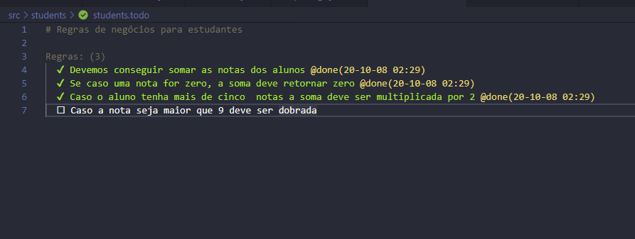

# TDD com Jest

```bash
# Instalar o Jest 
$ npx i -D jest

# Teste para ver se o Jest está instalado
$ npx jest

# Este comando ficará escutando as mudanças em seus arquivos
$ npx jest --watchAll
```
Agora para rodar seus testes com o [jest]() já instalado, precisamos configurar o seu [package.json]() atribuindo esses dois novos comandos para você iniciar seus testes.
```json
  "scripts": {
    "test": "jest",
    "watch-test": "jest --watchAll"
  }
```
Para rodar seu teste apenas troque o [npx] por [npm run]()
```bash
# para rodar seus testes apenas uma vez
$ npm run test

# Ou use este comando para não precisar ficar rodando toda vez o comando npm run test, 
# porque agora ficará escutando suas mudanças e toda vez que você salvar o arquivo de teste será rodado novamento.
$ npm run watch-all 
```

Crie um diretória chamado [tdd-jest]() em seguida abra a pasta.
```bash
$ mkdir tdd-jest; cd tdd-jest
```
Abra o [vscode]() no projeto que você acabou de criar.
```bash
$ code .
```
Ou abri o editor de sua preferência.

Crie dois diretórios src/students é onde você vai colocar seus arquivos.
```bash
$ mkdir src/students
```
Agora vá para o diretório students e crie três arquivos [students.test.js](), [students.todo]() e [student.js].
```bash
$ cd src/students
$ touch students.test.js students.todo student.js
```
Instale a extensão [todo+]() para ter esse visual no seu arquivo [students.todo]()


Vamos começar a escrever as regras de negócio no arquivo [students.todo]().
Neste exemplo irei escrever três regras:
```todo
# Regras de negócios para estudantes

Regras: (4)
  
  Devemos conseguir somar as notas dos alunos
  
  Se caso uma nota for zero, a soma deve retornar zero
  
  Caso o aluno tenha mais de cinco  notas a soma deve ser multiplicada por 2
  
  Caso a nota seja maior que 9 deve ser dobrada
```
Vamos escreve o primeiro teste no arquivo [students.test.js]()
```javascript
// importe o component students.test.js
const student = require('./student');

// Descrição do component a ser testado
describe('Teste para alunos', () => {
  // it e um alias de test
  //descrição de comportamento esperado
  it('Deve retornar 10 quando as notas forem 5, 3 e 2', () => {
    const notes = [5, 3, 2]
    expert(student.sum(notes)).toEqual(10)
  })
})
```
Devemas esquever o primeiro component em [student.js]().
1° função
```javascript
module.exports = {
  sum: notes => notes.reduce((acc, note) => {
    acc += note
    return acc
  })
}
```
Verifique no seu console que seu teste terá passado.
<hr>
<b>Vamos repetir o processo para todos teste e pronto.</b>

```javascript
// 2° Teste
it('Deve retornar zero quando uma das nota for zero', () => {
    const notes = [1, 2 , 3, 0]
    expect(student.sum(notes)).toEqual(0)
  })

// 3° Teste
 it('Deve dobrar a nota quando o aluno tive mais de cinco notas', () => {
    const notes = [1, 2, 3, 4, 5, 6, 7]
    expect(student.sum(notes)).toEqual(56)
  })

// 4° Teste
  it('Deve dobrar a nota quando for maior que 9', () => {
    const notes = [10, 5, 3]
    expect(student.sum(notes)).toEqual(28)
  })
```

Criando outros comportamentos e parametros conforme foi construido em nossos testes.
2° script
```javascript
module.exports = {
  sum:notes => {
    if(Math.min(...notes) === 0) {
      return 0
    }
    return notes.reduce((acc, note) => {
      acc += note
      return acc
    })
  }
}
```
3° script
```javascript
module.exports = {
  sum:notes => {
    if(Math.min(...notes)) {
      const result = notes.reduce((acc, note) => {
        acc += note
        return acc
      })
      return notes.length > 5 ? result * 2 : result
    }
    return 0
  }
}
```

[student.js]() script final.
```javascript
module.exports = {
  sum: notes => {
    if (Math.min(...notes)) {
      const result = notes.reduce((acc, note) => {
        acc += note > 9 ? note * 2 : note
        return acc
      }, 0)
      return notes.length > 5 ? result * 2 : result
    }
    return 0
  }
}
```

Espero que tenha ajudado nos primeiros passo em TDD js com [Jest](). ;)


